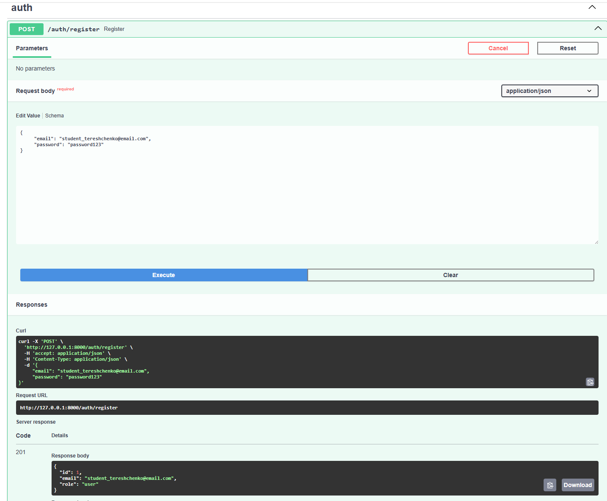
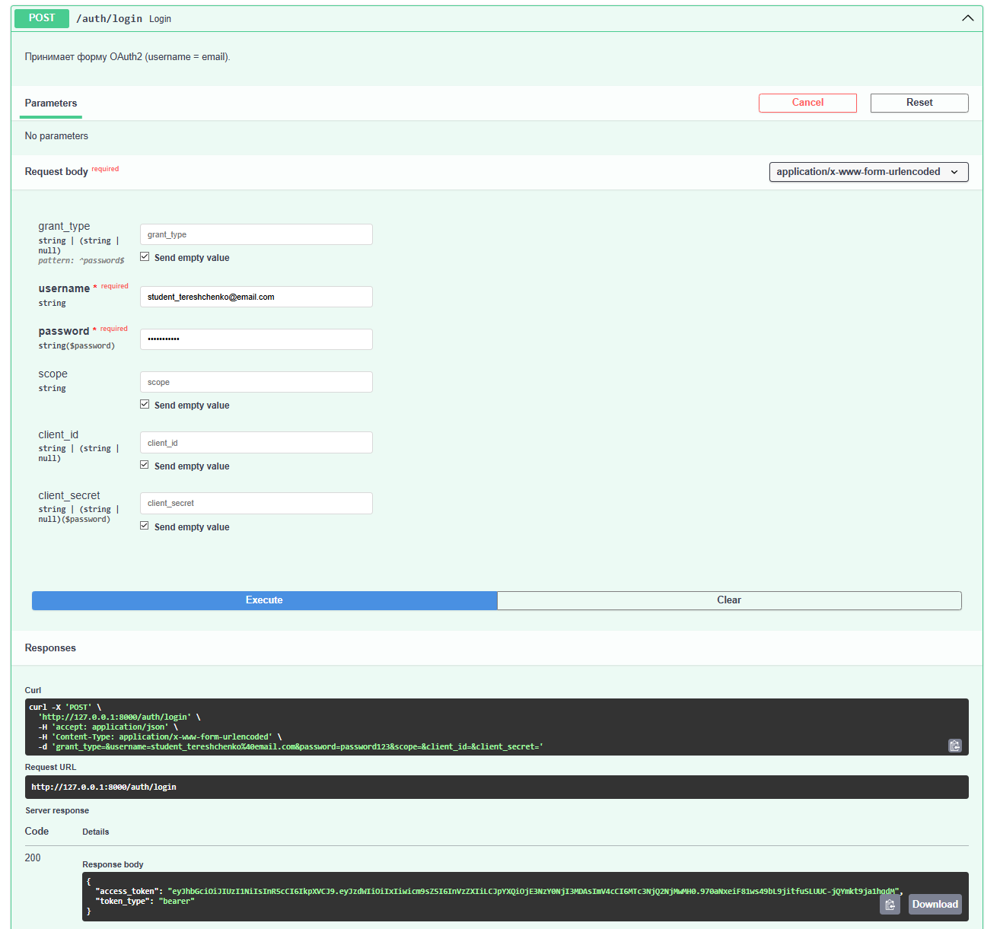
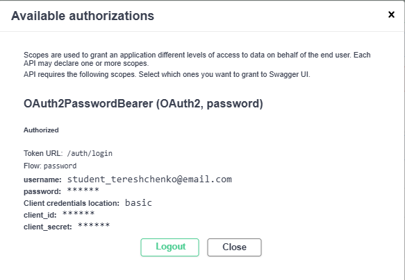
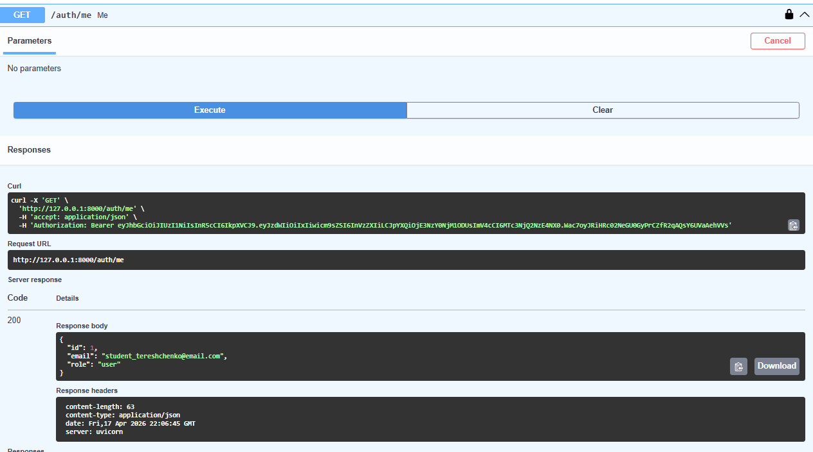
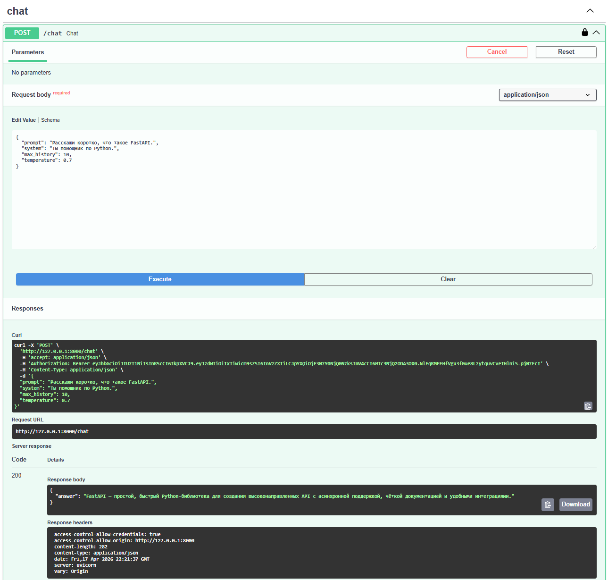
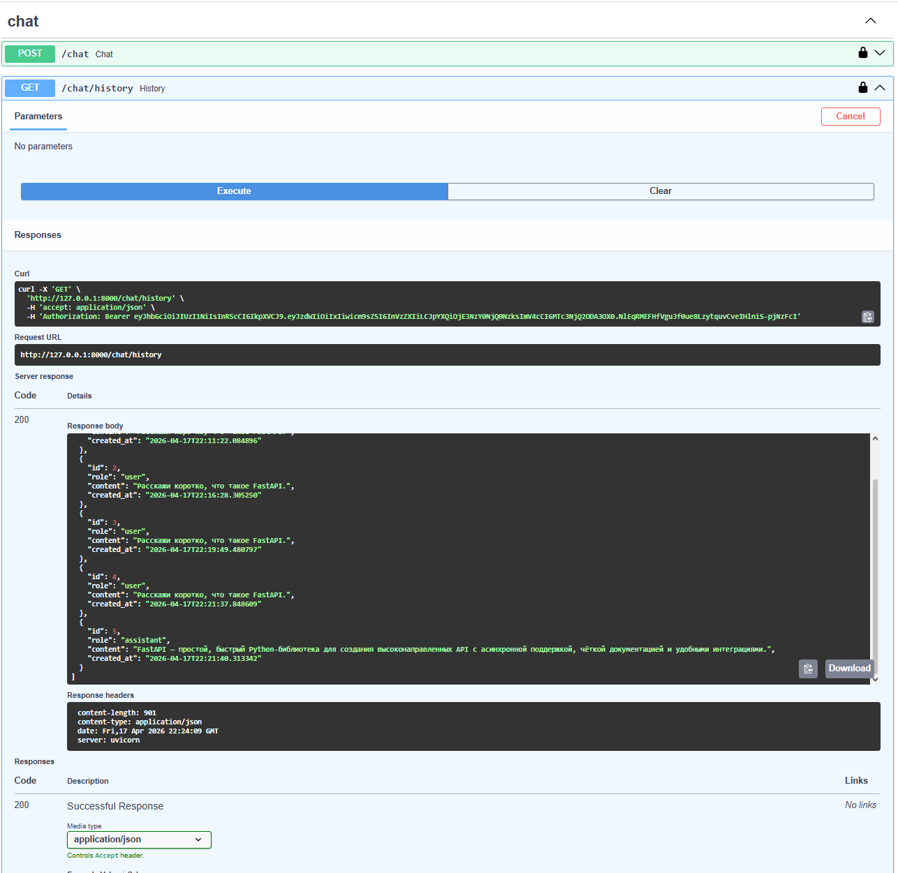
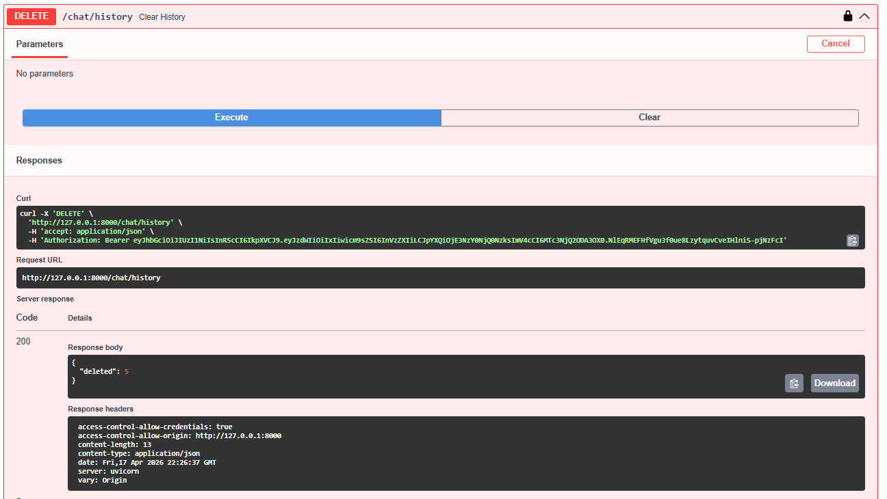

# llm-p

Защищённый API для работы с большой языковой моделью (LLM) через сервис OpenRouter.

Серверное приложение на **FastAPI** с JWT-аутентификацией, хранением данных в **SQLite** и чёткой архитектурой с разделением слоёв:

```
API → UseCases → Repositories → DB / Services
```

---

## Содержание

- [Стек](#стек)
- [Структура проекта](#структура-проекта)
- [Установка и запуск через uv](#установка-и-запуск-через-uv)
- [Настройка .env](#настройка-env)
- [Запуск сервера](#запуск-сервера)
- [Проверка линтером](#проверка-линтером)
- [Эндпоинты](#эндпоинты)
- [Тестирование через Swagger](#тестирование-через-swagger)
- [Скриншоты работы эндпоинтов](#скриншоты-работы-эндпоинтов)

---

## Стек

- Python 3.12+
- FastAPI + Uvicorn (ASGI)
- SQLAlchemy 2.x (async) + aiosqlite
- Pydantic v2 + pydantic-settings
- python-jose (JWT)
- passlib + bcrypt (хеширование паролей)
- httpx (HTTP-клиент к OpenRouter)
- uv (менеджер окружения и зависимостей)
- ruff (линтер)

---

## Структура проекта

```
llm_p/
├── pyproject.toml              # Зависимости проекта (uv)
├── README.md                   # Описание проекта и запуск
├── .env.example                # Пример переменных окружения
│
├── app/
│   ├── __init__.py
│   ├── main.py                 # Точка входа FastAPI
│   │
│   ├── core/                   # Общие компоненты и инфраструктура
│   │   ├── config.py           # Конфигурация приложения (env → Settings)
│   │   ├── security.py         # JWT, хеширование паролей
│   │   └── errors.py           # Доменные исключения
│   │
│   ├── db/                     # Слой работы с БД
│   │   ├── base.py             # DeclarativeBase
│   │   ├── session.py          # Async engine и sessionmaker
│   │   └── models.py           # ORM-модели (User, ChatMessage)
│   │
│   ├── schemas/                # Pydantic-схемы (вход/выход API)
│   │   ├── auth.py
│   │   ├── user.py
│   │   └── chat.py
│   │
│   ├── repositories/           # Репозитории (только SQL/ORM)
│   │   ├── users.py
│   │   └── chat_messages.py
│   │
│   ├── services/               # Внешние сервисы
│   │   └── openrouter_client.py
│   │
│   ├── usecases/               # Бизнес-логика
│   │   ├── auth.py
│   │   └── chat.py
│   │
│   └── api/                    # HTTP-слой
│       ├── deps.py
│       ├── routes_auth.py
│       └── routes_chat.py
```

---

## Установка и запуск через uv

### 1. Установите `uv`

```bash
pip install uv
```

### 2. Перейдите в каталог проекта

```bash
cd llm_p
```

### 3. Создайте виртуальное окружение

```bash
uv venv
```

### 4. Активируйте окружение

**Linux / macOS:**
```bash
source .venv/bin/activate
```

**Windows:**
```cmd
.venv\Scripts\activate.bat
```

### 5. Установите зависимости из `pyproject.toml`

```bash
uv pip install -r <(uv pip compile pyproject.toml)
```

> Команда выше для Bash/Zsh. На Windows :
> ```powershell
> uv pip compile pyproject.toml -o requirements.txt
> uv pip install -r requirements.txt
> ```

---

## Настройка .env

### 1. Получите API-ключ OpenRouter

Зарегистрируйтесь на [openrouter.ai](https://openrouter.ai) и создайте API-ключ.

### 2. Создайте файл `.env`

Скопируйте пример и отредактируйте:

```bash
cp .env.example .env
```

### 3. Вставьте ваш ключ OpenRouter

Откройте `.env` и укажите ключ в строке `OPENROUTER_API_KEY=` (после знака `=`, без кавычек):

```env
APP_NAME=llm-p
ENV=local

JWT_SECRET=change_me_super_secret
JWT_ALG=HS256
ACCESS_TOKEN_EXPIRE_MINUTES=60

SQLITE_PATH=./app.db

OPENROUTER_API_KEY=sk-or-v1-...ваш_ключ...
OPENROUTER_BASE_URL=https://openrouter.ai/api/v1
OPENROUTER_MODEL=stepfun/step-3.5-flash:free
OPENROUTER_SITE_URL=https://example.com
OPENROUTER_APP_NAME=llm-fastapi-openrouter
```

---

## Запуск сервера

```bash
uv run uvicorn app.main:app --reload --host 0.0.0.0 --port 8000
```

После запуска откройте:

**Swagger UI** — <http://0.0.0.0:8000/docs>

База SQLite (`app.db`) будет создана автоматически при первом запуске.

---

## Проверка линтером

```bash
ruff check
```

Ожидаемый ответ:

```
All checks passed!
```

Автоисправление (при необходимости):

```bash
ruff check --fix
```

---

## Эндпоинты

### auth

| Метод | Путь              | Описание                                  | Защищён |
|-------|-------------------|-------------------------------------------|---------|
| POST  | `/auth/register`  | Регистрация пользователя (email+пароль)   | -       |
| POST  | `/auth/login`     | Логин в формате OAuth2, выдача JWT        | -       |
| GET   | `/auth/me`        | Профиль текущего пользователя             | +       |

### chat

| Метод  | Путь             | Описание                                       | Защищён |
|--------|------------------|------------------------------------------------|---------|
| POST   | `/chat`          | Отправить запрос в LLM, получить ответ         | +       |
| GET    | `/chat/history`  | Получить историю диалога текущего пользователя | +       |
| DELETE | `/chat/history`  | Очистить историю текущего пользователя         | +       |

### health

| Метод | Путь      | Описание                                         |
|-------|-----------|--------------------------------------------------|
| GET   | `/health` | Проверка работоспособности (статус + окружение) |

---

## Тестирование через Swagger

1. Откройте <http://0.0.0.0:8000/docs>.
2. Выполните **`POST /auth/register`** — зарегистрируйте пользователя с email формата `student_<ваша_фамилия>@email.com`, например `student_ivanov@email.com`, и паролем длиной минимум 6 символов.
3. Выполните **`POST /auth/login`** — введите этот же email в поле `username` и пароль. В ответ получите `access_token`.
4. Нажмите кнопку **Authorize** в правом верхнем углу Swagger и вставьте полученный токен. После этого эндпоинты станут доступны.
5. Выполните **`POST /chat`** с телом, например:
   ```json
   {
     "prompt": "Расскажи, что такое FastAPI.",
     "system": "Ты помощник по Python.",
     "max_history": 10,
     "temperature": 0.7
   }
   ```
6. Выполните **`GET /chat/history`** — увидите список сообщений (user + assistant) текущего пользователя в хронологическом порядке.
7. Выполните **`DELETE /chat/history`** — история очистится, повторный `GET /chat/history` вернёт пустой список.

---

## Скриншоты работы эндпоинтов

Ниже приведены скриншоты работы всех эндпоинтов приложения. При регистрации использован email формата `student_tereshchenko@email.com`, который виден на скриншотах регистрации, логина, диалога авторизации и профиля.

> **Примечание о модели LLM.** На момент выполнения работы модель `stepfun/step-3.5-flash:free`, указанная в ТЗ, не поддерживается сервисом OpenRouter (при обращении возвращается `HTTP 404: No endpoints found for stepfun/step-3.5-flash:free`). В связи с этим в `.env` использована актуальная бесплатная модель `openrouter/free` — автороутер OpenRouter, который выбирает доступную бесплатную модель под запрос.

### 1. Регистрация пользователя (`POST /auth/register`)



### 2. Логин и получение JWT (`POST /auth/login`)



### 3. Авторизация через Swagger (кнопка **Authorize**)



### 4. Профиль пользователя (`GET /auth/me`)



### 5. Запрос к LLM (`POST /chat`)



### 6. История диалога (`GET /chat/history`)



### 7. Удаление истории (`DELETE /chat/history`)



